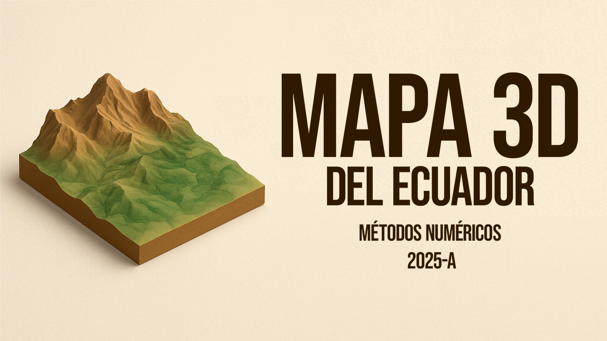

# 🗺️ Mapa 3D del Ecuador

<div align="center">
  
</div>


> **Generador de modelos 3D imprimibles de la topografía del Ecuador continental**  
> *Proyecto académico de Métodos Numéricos - Universidad*

## ✨ Características

- 🏔️ **Datos DEM reales** - Procesamiento de archivos de elevación digital
- 🖥️ **Interfaz gráfica intuitiva** - Aplicación de escritorio con Tkinter
- 🎯 **Filtrado inteligente** - Segmentación por regiones (Costa, Sierra, Oriente)
- 📐 **Validación de impresión** - Verificación automática para impresión 3D
- 📁 **Exportación STL** - Archivos listos para Bambu Studio, PrusaSlicer, etc.
- ⚡ **Procesamiento optimizado** - Algoritmos eficientes para mallas grandes

## 🚀 Inicio Rápido

### Instalación
```bash
# Clonar repositorio
git clone https://github.com/tu-usuario/mapa3d-ecuador.git
cd mapa3d-ecuador

# Instalar dependencias
pip install -r requirements.txt

# Ejecutar aplicación
python main.py
```

### Uso Básico
1. **Cargar DEM** → Seleccionar archivo de elevación (.tif, .hgt)
2. **Configurar** → Región, resolución, escala Z
3. **Procesar** → Generar malla 3D optimizada
4. **Exportar** → Archivo STL listo para impresión

## 🏗️ Arquitectura

```
📁 src/
├── 🗂️ data_processing/    # Carga y filtrado de datos DEM
├── 🖼️ gui/               # Interfaz gráfica principal  
├── 🔺 mesh_generation/   # Algoritmos de triangulación
├── ✅ validation/        # Validación para impresión 3D
└── 🛠️ utils/            # Configuración y utilidades
```

## 📊 Especificaciones Técnicas

| Característica | Especificación |
|---|---|
| **Formatos de entrada** | GeoTIFF (.tif), SRTM (.hgt) |
| **Formatos de salida** | STL, OBJ, PLY |
| **Resolución máxima** | 1M+ vértices |
| **Área de cobertura** | Ecuador continental (23 provincias) |
| **Precisión vertical** | ±30m (dependiente del DEM) |
| **Tamaño de impresión** | 5mm - 200mm (configurable) |

## 🎯 Casos de Uso

- 📚 **Educación** - Material didáctico para geografía
- 🔬 **Investigación** - Análisis topográfico y geológico  
- 🏛️ **Museos** - Exhibiciones interactivas
- 🎨 **Arte** - Esculturas topográficas personalizadas

## 🛠️ Tecnologías


## 📈 Estado del Desarrollo

- ✅ **Arquitectura base** - Estructura modular completa
- ✅ **Procesamiento DEM** - Carga y filtrado de datos
- ✅ **Interfaz gráfica** - Ventana principal funcional
- 🔄 **Generación de mallas** - Algoritmos implementados
- � **Validación STL** - Sistema de verificación
- ⏳ **Optimización** - Rendimiento para archivos grandes

## 📝 Documentación

- 📖 [**Guía de Instalación**](docs/installation.md) - Setup completo paso a paso
- 📘 [**Manual de Usuario**](docs/usage.md) - Casos de uso y ejemplos
- 🔧 [**API Reference**](docs/api_reference.md) - Documentación técnica

## 🤝 Contribución

Este es un proyecto académico desarrollado para el curso de **Métodos Numéricos**. Las contribuciones son bienvenidas:

1. Fork del repositorio
2. Crear branch feature (`git checkout -b feature/nueva-funcionalidad`)
3. Commit cambios (`git commit -am 'Agregar nueva funcionalidad'`)
4. Push al branch (`git push origin feature/nueva-funcionalidad`)
5. Crear Pull Request

## 📄 Licencia

**Proyecto Académico** - Desarrollado para fines educativos  
Universidad - Curso de Métodos Numéricos 2025-A

---

<div align="center">

**[🚀 Comenzar](docs/installation.md)** • **[📖 Documentación](docs/)** • **[🐛 Reportar Bug](issues/)** • **[💡 Solicitar Feature](issues/)**

*Creado con ❤️ para la comunidad académica ecuatoriana*

</div>
